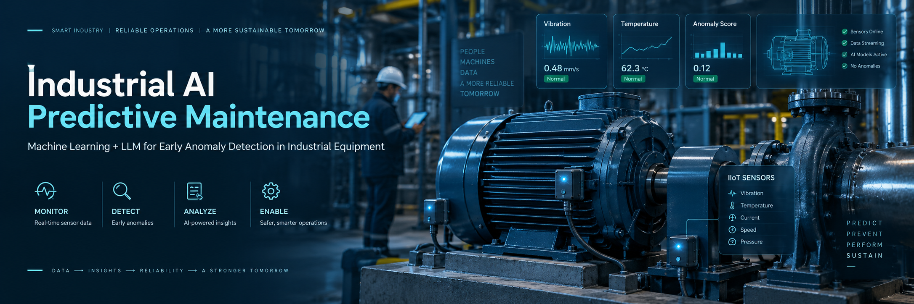

<div align="center">

<picture>
  <source media="(prefers-color-scheme: dark)" srcset="./industrial_ai_banner.png">
  <source media="(prefers-color-scheme: light)" srcset="./industrial_ai_banner.png">
  
</picture>

<br><br>

# MaintAI Copilot

### Intelligent Predictive Maintenance Assistant

<p>
<b>Machine Learning + Local LLM for Industrial Equipment Diagnosis</b>
</p>

<br>


<br><br>

<p>
MaintAI Copilot is an industrial predictive maintenance assistant that
combines Machine Learning, sensor analytics and a local Large Language Model
to identify abnormal equipment conditions, evaluate operational risk,
interpret predictive results and generate technical maintenance
recommendations.
</p>

</div>

---

## Project Overview

MaintAI Copilot is a predictive maintenance platform designed to support
industrial decision-making through the combination of:

- Machine Learning
- Industrial sensor analysis
- Statistical analysis
- Technical knowledge
- Local Large Language Models
- Interactive data visualization

The system receives operational variables from industrial equipment,
processes them through a Machine Learning prediction pipeline and generates
a technical diagnosis.

The diagnosis is then provided to a local LLM that interprets the model
output and communicates the result through a conversational maintenance
assistant.

The objective is to transform raw equipment measurements into information
that can support maintenance planning and operational decision-making.

---

## Industrial Challenge

Industrial equipment continuously generates operational data related to
temperature, vibration, pressure, electrical conditions, load, efficiency
and lubrication.

Traditional maintenance processes can depend heavily on periodic inspections
and manual interpretation of measurements. This can make it difficult to
identify abnormal operating conditions early and increase the risk of
unexpected downtime.

MaintAI Copilot addresses this problem by combining predictive analytics
with technical interpretation.

<table>
<tr>
<td width="50%" valign="top">

<h3>Traditional Maintenance</h3>

<ul>
<li>Reactive intervention after failures</li>
<li>Manual interpretation of measurements</li>
<li>Limited early-warning capability</li>
<li>Fragmented sensor information</li>
<li>High risk of unexpected downtime</li>
</ul>

</td>

<td width="50%" valign="top">

<h3>MaintAI Approach</h3>

<ul>
<li>Predictive equipment monitoring</li>
<li>Automated anomaly identification</li>
<li>Risk classification</li>
<li>Multivariable operational analysis</li>
<li>AI-assisted technical interpretation</li>
</ul>

</td>
</tr>
</table>

---

## Solution Architecture

The general architecture follows a sequential predictive maintenance
workflow:

```text
Industrial Equipment Sensors
            |
            v
     Operational Data
            |
            v
    Data Preprocessing
            |
            v
    Feature Preparation
            |
            v
 Machine Learning Prediction
            |
            v
    Anomaly Detection
            |
            v
 Technical Diagnosis Layer
            |
            v
     MaintAI Copilot
     Local LLM + Ollama
            |
            v
Maintenance Decision Support
